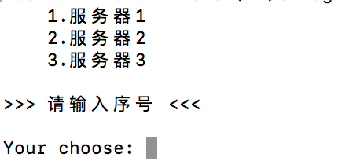

# passssh

### [安装sshpass(homebrew)](https://github.com/hudochenkov/homebrew-sshpass)

>brew install hudochenkov/sshpass/sshpass

### 查看sshpass是否安装成功
命令行执行：
>sshpass

### 脚本编辑 bin/s-login, 添加执行权限, 执行验证是否可用

### 全局脚本定义(适用于当前用户)
软连接: 
>ln -s ./bin/s-login /usr/local/bin/s-login

全局命令s-login执行

！注意环境变量问题

附加：sshpass+scp远程复制
  sshpass -p 123456 scp 文件 root@10.10.10.120:/home
